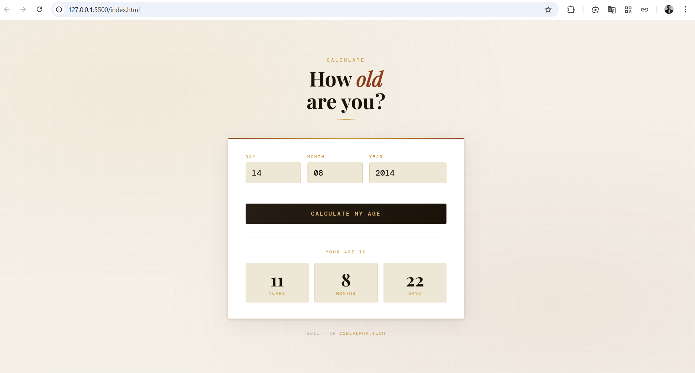

# Age Calculator

A web-based age calculator built with HTML, CSS, and JavaScript.

## Live Demo

🔗 [View Live Demo](https://age-calculator-r40c.onrender.com)

> Replace the link above with your actual deployed URL (e.g. from GitHub Pages, Netlify, or Vercel)

## Screenshots



## Features

- Input date of birth (day, month, year)
- Calculates exact age in years, months, and days
- Input validation and error handling
- Keyboard support — press Enter to calculate
- Birthday detection 🎂

## Project Structure

```
age-calculator/
│
├── index.html       # Main HTML structure and layout
├── index.css        # All styling and animations
├── index.js         # Age calculation logic and DOM manipulation
├── .gitignore       # Files to ignore in version control
├── LICENSE          # MIT License
└── README.md        # Project documentation
```

## How to Use

1. Clone the repository:
   ```bash
   git clone https://github.com/Khojoe/age-calculator.git
   ```
2. Open `index.html` in any browser — no installation needed.

## Built With

- **HTML** — page structure and input form
- **CSS** — styling, layout, and animations
- **JavaScript** — age calculation, DOM manipulation, and input validation

## License

MIT
